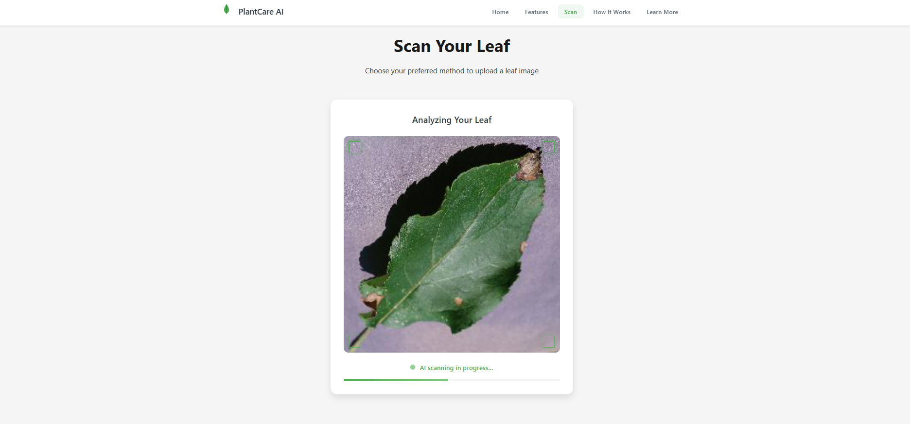
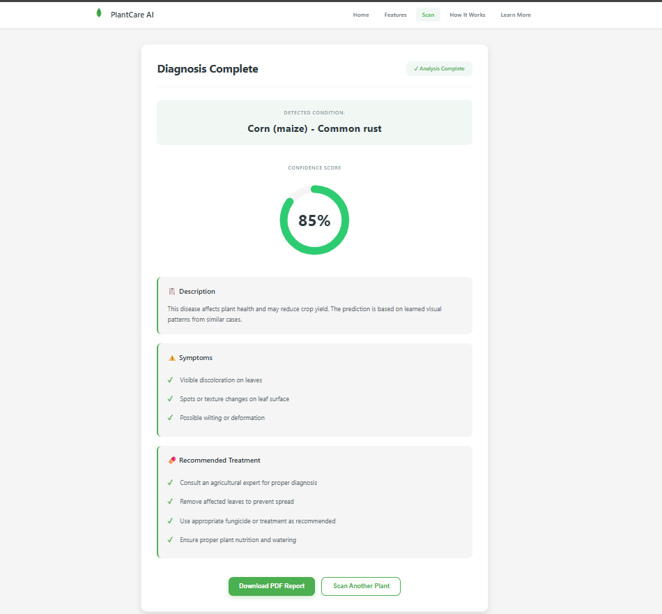
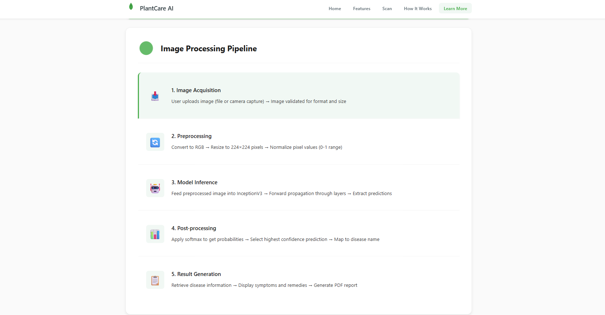

# 🌿 Plant Disease Detection System

An AI-powered **Plant Disease Detection Web Application** built using **Flask, TensorFlow, and Deep Learning**.
The system analyzes plant leaf images and predicts plant diseases using trained **CNN (Convolutional Neural Network)** and **InceptionV3 Transfer Learning models**.

This application helps farmers and researchers **detect plant diseases early** and take preventive measures to reduce crop loss.

---

# 📌 Features

* 🌱 Upload plant leaf images for disease detection
* 🤖 Deep learning based disease classification
* 🧠 Supports **CNN and InceptionV3 models**
* 📊 Displays disease **description, symptoms, and remedies**
* 📄 Generate downloadable **PDF disease report**
* ☁️ Automatic **model download from Google Drive**
* 🌐 Clean and responsive web interface

---

# 🧠 Deep Learning Models

This project uses two trained models.

## 1️⃣ CNN Model

A custom **Convolutional Neural Network (CNN)** trained on the PlantVillage dataset.

Model Download Link:

```id="qsv5oc"
https://drive.google.com/file/d/1TEZz6dUAgi3ZERD4MNt-_X05OXKgmBx1/view?usp=drive_link
```

---

## 2️⃣ InceptionV3 Model

A **Transfer Learning model** using the pretrained **InceptionV3 architecture**.

Model Download Link:

```id="3f8vrk"
https://drive.google.com/file/d/1JmJbkLF4WQLkgSKJmvy2ac6CfELxarb4/view?usp=sharing
```

---

# 📊 Dataset

The model was trained using the **PlantVillage Dataset**, which contains thousands of labeled plant leaf images.

Dataset Source (Kaggle):

```id="2ns2db"
https://www.kaggle.com/datasets/emmarex/plantdisease
```

Dataset includes:

* Healthy plant leaves
* Diseased plant leaves
* Multiple crop types
* Multiple disease categories

---

# 🛠 Technologies Used

* Python
* Flask
* TensorFlow / Keras
* NumPy
* Pillow
* ReportLab
* HTML
* CSS
* JavaScript

---

# ⚙️ Installation

## 1️⃣ Clone the Repository

```id="uay1vo"
git clone https://github.com/g-sravani1512/plant-disease-detection.git
```

```id="17ctzo"
cd plant-disease-detection
```

---

## 2️⃣ Create Virtual Environment

```id="fkk1u2"
python -m venv venv
```

Activate environment

Windows:

```id="2excf6"
venv\Scripts\activate
```

Mac/Linux:

```id="pxix89"
source venv/bin/activate
```

---

## 3️⃣ Install Dependencies

```id="u3jn33"
pip install -r requirements.txt
```

---

# ▶️ Run the Application

Start the Flask server:

```id="6l9bri"
python main.py
```

The application will run at:

```id="5g6bl1"
http://127.0.0.1:5000
```

---

## 🔄 Automatic Model Download

When the application starts, it automatically checks whether the trained model is available locally.

If the model is not found, the system performs the following steps:

1. Checks whether the model file exists in the `models/` directory.
2. If the model is missing, it automatically downloads the model from **Google Drive**.
3. The downloaded model is stored inside the `models/` folder.
4. **TensorFlow** then loads the model and the application becomes ready to perform predictions.

This approach keeps the GitHub repository **lightweight** and avoids GitHub's file size limitations while still allowing the application to run normally.


---

# 📄 PDF Report Generation

After prediction, the application generates a **disease analysis report** containing:

* Disease Name
* Prediction Confidence
* Disease Description
* Symptoms
* Remedies

Users can download the report as a **PDF file**.

---

# 📁 Project Structure

```id="aq8he4"
PLANT_DISEASE_DETECTION
│
├── data
│   └── disease_info.json
│
├── dataset
│   └── PlantVillage
│       ├── train
│       └── val
│
├── models
│   ├── cnn_model.h5
│   └── inceptionv3_model.h5
│
├── reports
│   ├── pdfs
│   ├── class_indices.json
│   ├── classification_report.txt
│   ├── confusion_matrix_cnn.png
│   ├── confusion_matrix_inceptionv3.png
│   ├── evaluation_summary.txt
│   ├── final_summary.txt
│   ├── model_comparison.txt
│   ├── model_comparison.csv
│   ├── model_comparison.png
│   └── roc_curve.png
│
├── src
│   ├── building_cnn.py
│   ├── evaluate_models.py
│   ├── evaluation_plots.py
│   ├── preprocess_images.py
│   ├── test_env.py
│   ├── training_cnn.py
│   ├── training_inceptionv3.py
│   └── view_image.py
│
├── static
│   ├── css
│   │   ├── style.css
│   │   └── working.css
│   │
│   ├── images
│   │   ├── icons
│   │   ├── plants
│   │   └── steps
│   │
│   └── js
│       └── main.js
│
├── streamlit_app
│   ├── app.py
│   └── utils.py
│
├── templates
│   ├── index.html
│   └── working.html
│
├── uploads
│
├── venv
│
├── .gitignore
├── evaluation_plots.py
├── generate_class_indices.py
├── main.py
├── requirements.txt
└── README.md
```

---

# 🚀 Future Improvements

* Mobile application integration
* IoT-based plant monitoring system
* Multi-language support for farmers
* More crop disease categories

---

## 🌿 Project Demo

<p align="center">
  <b>Scanning Leaf</b>
</p>

<p align="center">
  
</p>

<br>

<p align="center">
  <b>Disease Detection Result</b>
</p>

<p align="center">
  
</p>

<br>

<p align="center">
  <b>Architecture</b>
</p>

<p align="center">
  
</p>


 ---

# 👩‍💻 Author

**Sravani G**

GitHub:

```id="d9q4j4"
https://github.com/g-sravani1512
```

---

# 📜 License

This project is developed for **educational and research purposes**.
